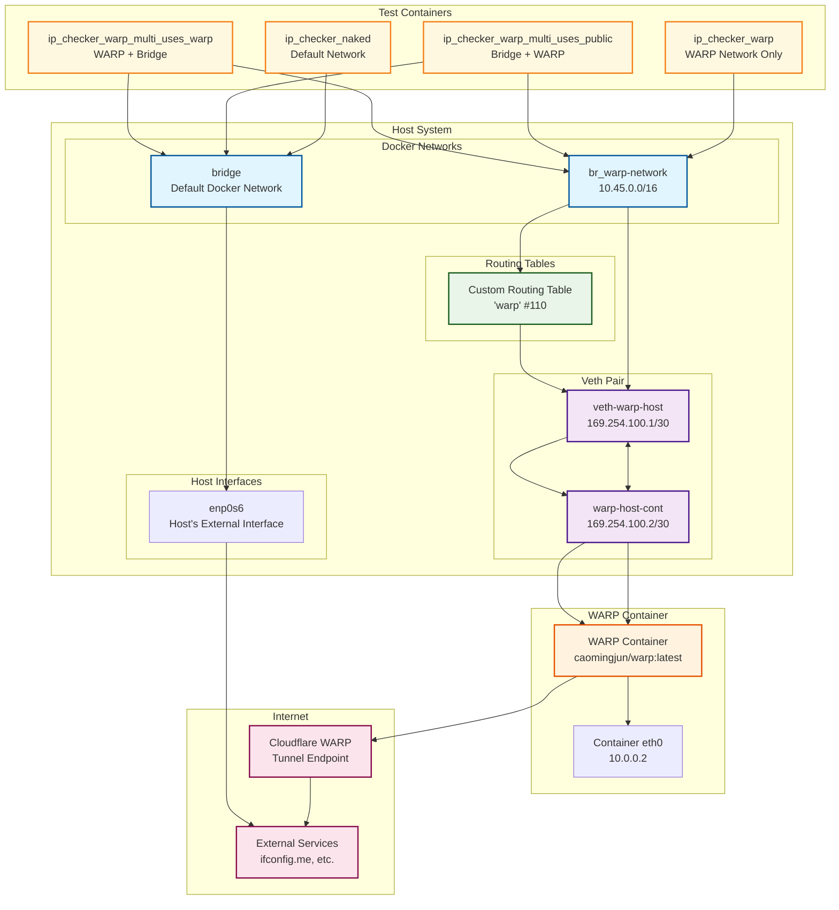

# WARP Docker NAT

A comprehensive solution for routing Docker container traffic through Cloudflare WARP using NAT (Network Address Translation) instead of the traditional SOCKS5 proxy approach.

## 🎯 Problem Solved

Traditional WARP setups typically use SOCKS5 proxy on port 1080, which has limitations:

- **Split tunneling is nearly impossible** when WARP is installed on the host
- **Complex routing configuration** required for selective traffic routing
- **Limited Docker network integration** - most examples only show basic proxy usage
- **Difficult NAT setup** - hard to figure out how to route through specific Docker networks

This project solves these issues by:

- **Using NAT instead of SOCKS5** for seamless traffic routing
- **Proper Docker network integration** with custom routing tables
- **Split tunneling support** through selective network routing
- **Systemd service integration** for production deployment

## 🚀 Features

- **NAT-based routing** in addition to SOCKS5
- **Docker network created** that can be assigned to your Containers
- **Configurable network parameters** via CLI arguments
- **Comprehensive validation** for all network configurations
- **Systemd service integration** with proper logging
- **Automatic startup** on system boot

## 📋 Requirements

- **Linux** with systemd
- **Docker** daemon running
- **Root privileges** for network operations
- **`bc` command** for network calculations

## 🏗️ Architecture

```
┌─────────────────┐    ┌─────────────────┐    ┌─────────────────┐
│   Docker        │    │   WARP          │    │   Internet      │
│   Container     │───▶│   Container     │───▶│   (via WARP)    │
│   (10.45.0.0/16)│    │   (NAT Gateway) │    │                 │
└─────────────────┘    └─────────────────┘    └─────────────────┘
         │                       │
         │              ┌─────────────────┐
         └──────────────│   Custom        │
                        │   Routing       │
                        │   Table         │
                        └─────────────────┘
```

## 🚀 Quick Start

### 1. Install the Service

```bash
cd warp-docker-nat
sudo ./setup-warp-service.sh
```

### 2. Start the Service

```bash
sudo systemctl start warp
sudo systemctl enable warp  # Enable on boot
```

### 3. Check Status

```bash
sudo systemctl status warp
sudo journalctl -u warp -f  # View real-time logs
```

### 4. Test with a Container

```bash
# Run a container on the WARP network
docker run --rm --network warp-network alpine:latest sh -c "curl -s ifconfig.me"
```

## 📁 Project Structure

```
warp-docker-nat/
├── README.md                    # This file
├── warp-up.sh                   # Main setup script with CLI arguments
├── warp-down.sh                 # Cleanup script
├── warp.service                 # Systemd service file
├── warp.env.template            # Environment variables template
├── setup-warp-service.sh        # Complete setup script
├── install-warp-service.sh      # Service installation script
├── test-warp-up.sh             # CLI argument testing
├── test-service.sh             # Service functionality testing
├── WARP_CONFIGURATION.md       # CLI configuration documentation
└── SYSTEMD_SERVICE.md          # Systemd service documentation
```

## ⚙️ Configuration

### CLI Arguments (warp-up.sh)

The script supports comprehensive CLI arguments for customization:

```bash
# Basic usage with defaults
sudo ./warp-up.sh

# Custom network configuration
sudo ./warp-up.sh --network-name my-warp --docker-net 192.168.100.0/24

# Custom IP addresses
sudo ./warp-up.sh --host-ip 169.254.200.1 --container-ip 169.254.200.2

# Multiple custom values
sudo ./warp-up.sh -n my-warp -d 192.168.100.0/24 -r mytable -h 169.254.200.1 -c 169.254.200.2
```

**Available Options:**

- `-n, --network-name` - Docker network name
- `-v, --veth-host` - Host veth interface name
- `-h, --host-ip` - Host veth IP address
- `-c, --container-ip` - Container veth IP address
- `-d, --docker-net` - Docker network CIDR
- `-r, --routing-table` - Routing table name

### Environment Variables (Optional)

| Variable | Description | Default | Required |
|----------|-------------|---------|----------|
| `WARP_LICENSE_KEY` | WARP Teams license key | (unset) | No |
| `WARP_TUNNEL_TOKEN` | WARP Teams tunnel token | (unset) | No |
| `WARP_SLEEP` | Sleep time for WARP container | `2` | No |
| `WARP_DISABLE_IPV6` | Disable IPv6 in WARP container | `1` | No |

**Note:** All environment variables are optional. WARP will run in free mode by default.

## 🔧 Service Management

### Basic Commands

```bash
# Start/Stop/Restart
sudo systemctl start warp
sudo systemctl stop warp
sudo systemctl restart warp

# Status and Logs
sudo systemctl status warp
sudo journalctl -u warp -f
sudo journalctl -u warp --since '1 hour ago'

# Enable/Disable on Boot
sudo systemctl enable warp
sudo systemctl disable warp
```

### Logging

```bash
# Real-time logs
sudo journalctl -u warp -f

# Recent logs with timestamps
sudo journalctl -u warp -o short-iso --since '1 hour ago'

# Error logs only
sudo journalctl -u warp -p err

# Service-specific logs
sudo journalctl -t warp-service
```

## 🔍 Validation Features

The `warp-up.sh` script includes some various validations:

- **IP Address Validation**: Format checking, octet validation, conflict detection
- **CIDR Validation**: Format checking, prefix length validation, subnet overlap detection
- **Interface Name Validation**: Character restrictions, length limits, conflict checking
- **Docker Network Validation**: Uniqueness checking, conflict detection
- **Routing Table Validation**: Uniqueness checking, table number availability

## 📖 Usage Examples

### Basic Setup (Free WARP)

```bash
# Install and start with default settings
sudo ./setup-warp-service.sh
sudo systemctl start warp

# Test with a container
docker run --rm --network warp-network alpine:latest sh -c "curl -s ifconfig.me"
```

### Custom Network Configuration

```bash
# Use custom network settings
sudo ./warp-up.sh --network-name my-warp --docker-net 192.168.100.0/24

# Run containers on custom network
docker run --rm --network my-warp alpine:latest sh -c "curl -s ifconfig.me"
```

### WARP Teams Setup

```bash
# Install with Teams credentials
WARP_LICENSE_KEY=your_key WARP_TUNNEL_TOKEN=your_token sudo ./setup-warp-service.sh
sudo systemctl start warp
```

### Split Tunneling

```bash
# Route only specific containers through WARP
docker run --rm --network warp-network app1  # Goes through WARP
docker run --rm --network bridge app2        # Goes through normal internet
```

## 🐛 Troubleshooting

### Common Issues

1. **Service Fails to Start**

   ```bash
   sudo systemctl status warp
   sudo journalctl -u warp --since '5 minutes ago'
   ```

2. **Permission Denied**

   ```bash
   sudo systemctl show warp | grep User
   ls -la /path/to/warp-up.sh
   ```

## 📚 Documentation

- **[WARP_CONFIGURATION.md](WARP_CONFIGURATION.md)** - Detailed CLI configuration guide
- **[SYSTEMD_SERVICE.md](SYSTEMD_SERVICE.md)** - Comprehensive systemd service documentation

**Note:** After installation, documentation is available at `/usr/local/share/warp-docker-nat/`

## 🔄 Uninstallation

To completely remove the service:

```bash
sudo ./uninstall_warp_service.sh
```

or manually:

```bash
# Stop and disable service
sudo systemctl stop warp
sudo systemctl disable warp

# Remove service files
sudo rm /etc/systemd/system/warp.service
sudo rm -rf /etc/systemd/system/warp.service.d

# Remove installed scripts and files
sudo rm -f /usr/local/bin/warp-up.sh
sudo rm -f /usr/local/bin/warp-down.sh
sudo rm -rf /usr/local/share/warp-docker-nat

# Reload systemd
sudo systemctl daemon-reload
sudo systemctl reset-failed
```

## 🤝 Contributing

This project is designed to solve the specific problem of WARP Docker NAT routing. Contributions are welcome for:

- Bug fixes
- Additional validation rules
- Enhanced logging
- Security improvements
- Documentation updates

## 📄 License

This project is provided as-is for educational and operational purposes.

## 🙏 Acknowledgments

- Cloudflare for WARP
- Docker community for container networking
- Systemd developers for service management

---

## 🔄 WARP NAT Routing Flow (warp-up-minimal.sh)

### 📊 Network Architecture Diagram



### 🔍 Detailed Flow Explanation

#### **1. Network Setup Phase**

1. **WARP Container Launch**
   - Starts `caomingjun/warp:latest` with network capabilities
   - Container gets default Docker network (10.0.0.0/24)
   - WARP client initializes and establishes tunnel to Cloudflare

2. **Custom Docker Network Creation**
   - Creates `warp-network` (10.45.0.0/16) with bridge `br_warp-network`
   - This network will be used by containers that should route through WARP

3. **Veth Pair Creation**
   - Creates virtual ethernet pair: `veth-warp-host` ↔ `warp-host-cont`
   - Host side: `veth-warp-host` (169.254.100.1/30)
   - Container side: `warp-host-cont` (169.254.100.2/30)
   - Moves container end into WARP container namespace

#### **2. Routing Configuration**

1. **Custom Routing Table**
   - Creates routing table `warp` (#110)
   - Routes traffic from `10.45.0.0/16` through this table
   - Default route via `169.254.100.2` (container veth IP)

2. **Policy Routing Rules**
   - `ip rule add from 10.45.0.0/16 table warp`
   - `ip rule add iif br_warp-network table warp`
   - Forces traffic from WARP network through custom routing

3. **NAT Configuration**
   - Host: NATs traffic from `10.45.0.0/16` out external interface
   - Container: NATs traffic from `10.45.0.0/16` through WARP tunnel

#### **3. Traffic Flow Paths**

##### **Path A: WARP Network Traffic**
```
Container (10.45.0.x) → br_warp-network → veth-warp-host → veth-warp-cont → WARP Container → Cloudflare WARP → Internet
```

##### **Path B: Default Network Traffic**
```
Container → bridge → enp0s6 → Internet (direct)
```

##### **Path C: Multi-Network Priority**
- **WARP Priority**: Traffic routes through WARP network first
- **Public Priority**: Traffic routes through default network first

#### **4. IP Testing & Validation**

The script runs comprehensive tests to verify routing:

1. **IP Checker Naked** (`ip_checker_naked`)
   - Uses default Docker network
   - Should get host's public IP via `enp0s6`
   - Establishes baseline for comparison

2. **IP Checker WARP** (`ip_checker_warp`)
   - Uses only WARP network
   - Should get WARP tunnel's external IP
   - Must differ from baseline public IP

3. **IP Checker WARP Multi Uses Public** (`ip_checker_warp_multi_uses_public`)
   - Connected to both bridge and WARP networks
   - Bridge is default priority
   - Should get baseline public IP

4. **IP Checker WARP Multi Uses WARP** (`ip_checker_warp_multi_uses_warp`)
   - Connected to both WARP and bridge networks
   - WARP has higher priority
   - Should get WARP external IP

#### **5. Key Technical Details**

##### **Veth Pair Function**
- **Host Side**: Acts as gateway for WARP network traffic
- **Container Side**: Receives traffic and forwards to WARP process
- **Bridging**: Connects Docker network to WARP container

##### **Routing Table Logic**
- **Source-based routing**: Traffic from `10.45.0.0/16` uses custom table
- **Interface-based routing**: Traffic entering `br_warp-network` uses custom table
- **Default gateway**: Routes via veth pair to WARP container

##### **NAT Chain**
- **Host NAT**: Masquerades WARP network traffic out external interface
- **Container NAT**: Masquerades WARP network traffic through WARP tunnel
- **No double-NAT**: Traffic flows through one NAT point only

#### **6. Network Isolation Benefits**

1. **Selective Routing**: Only containers on `warp-network` use WARP
2. **Split Tunneling**: Other containers use normal internet
3. **Network Separation**: WARP traffic isolated from host traffic
4. **Configurable**: Easy to add/remove containers from WARP routing

#### **7. Troubleshooting Points**

- **WARP Container Status**: Check `docker logs warp`
- **Routing Table**: Verify `ip route show table warp`
- **NAT Rules**: Check `iptables -t nat -L`
- **Veth Status**: Verify `ip link show veth-warp-host`
- **Container Connectivity**: Test with `docker exec container ping 8.8.8.8`

This architecture provides a robust, scalable solution for routing Docker container traffic through Cloudflare WARP while maintaining network isolation and enabling split tunneling capabilities.
