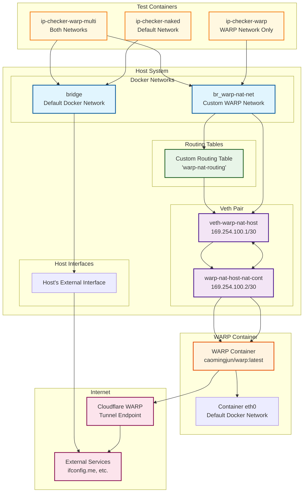

# WARP Docker NAT

A comprehensive solution for routing Docker container traffic through Cloudflare WARP using NAT (Network Address Translation) instead of the traditional SOCKS5 proxy approach.

## 🎯 Problem Solved

Traditional WARP setups typically use SOCKS5 proxy on port 1080, which has limitations:

- **Split tunneling is nearly impossible** when WARP is installed on the host
- **Complex routing configuration** required for selective traffic routing
- **Limited Docker network integration** - most examples only show basic proxy usage
- **Difficult NAT setup** - hard to figure out how to route through specific Docker networks

This project solves these issues by:

- **Using NAT instead of SOCKS5** for seamless traffic routing
- **Proper Docker network integration** with custom routing tables
- **Split tunneling support** through selective network routing
- **Docker Compose integration** for easy deployment and management

## 🚀 Features

- **NAT-based routing** in addition to SOCKS5
- **Docker network created** that can be assigned to your containers
- **Configurable network parameters** via environment variables
- **Comprehensive validation** for all network configurations
- **Docker Compose deployment** with health checks and monitoring
- **Automatic network setup** via init container

## 📋 Requirements

- **Linux** with Docker and Docker Compose
- **Docker daemon** running
- **Root privileges** for network operations (when running setup scripts)
- **`bc` command** for network calculations

## 🏗️ Architecture

```
┌─────────────────┐    ┌─────────────────┐    ┌─────────────────┐
│   Docker        │    │   WARP          │    │   Internet      │
│   Container     │───▶│   Container     │───▶│   (via WARP)    │
│   (warp-nat-net)│    │   (NAT Gateway) │    │                 │
└─────────────────┘    └─────────────────┘    └─────────────────┘
         │                       │
         │              ┌─────────────────┐
         └──────────────│   Custom        │
                        │   Routing       │
                        │   Table         │
                        └─────────────────┘
```

## 🚀 Quick Start

### 1. Clone and Navigate

```bash
git clone <repository-url>
cd warp-nat-routing
```

**Available Environment Variables:**

| Variable | Description | Default | Required |
|----------|-------------|---------|----------|
| `WARP_LICENSE_KEY` | WARP Teams license key | (unset) | No |
| `WARP_TUNNEL_TOKEN` | WARP Teams tunnel token | (unset) | No |
| `GOST_SOCKS5_PORT` | SOCKS5 proxy port | `1080` | No |
| `GOST_ARGS` | Additional GOST arguments | `-L :1080` | No |

**Note:** All environment variables are optional. WARP will run in free mode by default.

### 2. Start the Stack

```bash
# Start all services
docker-compose up -d

# View logs
docker-compose logs -f
```

### 3. Check Status

```bash
# Check service status
docker-compose ps

# Check WARP container health
docker-compose logs warp-nat-gateway

# Check routing setup
docker-compose logs warp_router
```

### 4. Test with a Container

```bash
# Run a container on the WARP network
docker run --rm --network warp-nat-net alpine:latest sh -c "curl -s ifconfig.me"
```

## 📁 Project Structure

```
warp-nat-routing/
├── README.md                    # This file
├── docker-compose.yml           # Main Docker Compose configuration
├── warp-nat-setup.sh           # Network setup script (embedded in compose)
├── WARP_CONFIGURATION.md       # Configuration documentation
├── recreate_warp_docker_network.sh # Network recreation script
└── tests/                      # Test scripts
    ├── test-project.sh         # Project validation tests
    ├── test-warp-up.sh         # Configuration testing guide
    └── test-interface-names.sh # Interface naming tests
```

## ⚙️ Configuration

### Docker Compose Services

The stack consists of several services:

1. **`warp-nat-gateway`** - Main WARP container with NAT enabled
2. **`warp_router`** - Init container that sets up network routing
3. **`ip-checker-*`** - Test containers for validating routing

### Network Configuration

The `warp-nat-setup.sh` script (embedded in the compose file) handles:

- **Docker Network Creation**: Creates `warp-nat-net` with custom bridge settings
- **Veth Pair Setup**: Establishes virtual ethernet connection between host and WARP container
- **Routing Table Configuration**: Sets up custom routing table for WARP traffic
- **NAT Rules**: Configures iptables rules for proper traffic flow

### Environment Variables

| Variable | Description | Default | Required |
|----------|-------------|---------|----------|
| `WARP_LICENSE_KEY` | WARP Teams license key | (unset) | No |
| `WARP_TUNNEL_TOKEN` | WARP Teams tunnel token | (unset) | No |
| `GOST_SOCKS5_PORT` | SOCKS5 proxy port | `1080` | No |
| `GOST_ARGS` | Additional GOST arguments | `-L :1080` | No |
| `BETA_FIX_HOST_CONNECTIVITY` | Auto-fix host connectivity | `false` | No |

## 🔧 Service Management

### Basic Commands

```bash
# Start all services
docker-compose up -d

# Stop all services
docker-compose down

# Restart specific service
docker-compose restart warp-nat-gateway

# View logs
docker-compose logs -f
docker-compose logs warp-nat-gateway
docker-compose logs warp_router

# Check status
docker-compose ps
```

### Network Management

```bash
# Recreate the WARP network (if needed)
sudo ./recreate_warp_docker_network.sh

# Check network status
docker network ls | grep warp
docker network inspect warp-nat-net

# Check routing tables
ip route show table warp-nat-routing
```

## 🔍 Validation Features

The stack includes comprehensive testing:

- **IP Checker Naked**: Uses default Docker network (baseline)
- **IP Checker WARP**: Uses only WARP network (should get WARP IP)
- **IP Checker Multi**: Connected to both networks for testing priority

### Testing Commands

```bash
# Check all test containers
docker-compose ps ip-checker-*

# View test results
docker-compose logs ip-checker-naked
docker-compose logs ip-checker-warp
docker-compose logs ip-checker-warp-multi-uses-warp

# Manual test
docker run --rm --network warp-nat-net alpine:latest sh -c "curl -s ifconfig.me"
```

## 📖 Usage Examples

### Basic Setup (Free WARP)

```bash
# Start with default settings
docker-compose up -d

# Test routing
docker run --rm --network warp-nat-net alpine:latest sh -c "curl -s ifconfig.me"
```

### WARP Teams Setup

```bash
# Create .env file with credentials
cat > .env << EOF
WARP_LICENSE_KEY=your_key_here
WARP_TUNNEL_TOKEN=your_token_here
EOF

# Start services
docker-compose up -d
```

### Split Tunneling

```bash
# Route only specific containers through WARP
docker run --rm --network warp-nat-net app1  # Goes through WARP
docker run --rm --network bridge app2        # Goes through normal internet

# Multi-network container (WARP priority)
docker run --rm \
  --network warp-nat-net \
  --network public \
  alpine:latest sh -c "curl -s ifconfig.me"
```

## 🐛 Troubleshooting

### Common Issues

1. **Network Setup Fails**

   ```bash
   # Check router logs
   docker-compose logs warp_router
   
   # Check WARP container status
   docker-compose logs warp-nat-gateway
   
   # Verify network exists
   docker network ls | grep warp
   ```

2. **Permission Denied**

   ```bash
   # Ensure running with proper privileges
   sudo docker-compose up -d
   
   # Check container capabilities
   docker inspect warp_router | grep -A 10 "CapAdd"
   ```

3. **Routing Issues**

   ```bash
   # Check routing table
   ip route show table warp-nat-routing
   
   # Check iptables rules
   sudo iptables -t nat -L | grep warp
   
   # Verify veth interfaces
   ip link show | grep veth
   ```

### Debug Mode

```bash
# View detailed logs
docker-compose logs -f warp_router
docker-compose logs -f warp-nat-gateway

# Check container network configuration
docker exec warp-nat-gateway ip route
docker exec warp-nat-gateway iptables -t nat -L

# Test connectivity
docker exec warp-nat-gateway ping -c 3 8.8.8.8
```

## 🔄 Network Recreation

If you need to recreate the WARP network:

```bash
# Use the provided script
sudo ./recreate_warp_docker_network.sh

# Or manually
docker-compose down
docker network rm warp-nat-net
docker-compose up -d
```

## 📚 Documentation

- **[WARP_CONFIGURATION.md](WARP_CONFIGURATION.md)** - Detailed configuration guide
- **Docker Compose documentation** - [Official docs](https://docs.docker.com/compose/)

## 🔄 Uninstallation

To completely remove the stack:

```bash
# Stop and remove all services
docker-compose down

# Remove networks
docker network rm warp-nat-net 2>/dev/null || true

# Remove volumes
docker volume rm warp-nat-routing_warp-config-data 2>/dev/null || true

# Clean up any remaining containers
docker container prune -f
```

## 🤝 Contributing

This project is designed to solve the specific problem of WARP Docker NAT routing. Contributions are welcome for:

- Bug fixes
- Additional validation rules
- Enhanced logging
- Security improvements
- Documentation updates

## 📄 License

This project is provided as-is for educational and operational purposes.

## 🙏 Acknowledgments

- Cloudflare for WARP
- Docker community for container networking
- The `caomingjun/warp` Docker image maintainers

---

## 🔄 WARP NAT Routing Flow

### 📊 Network Architecture Diagram



### 🔍 Detailed Flow Explanation

#### **1. Network Setup Phase**

1. **WARP Container Launch**
   - Starts `caomingjun/warp:latest` with NAT enabled
   - Container gets default Docker network
   - WARP client initializes and establishes tunnel to Cloudflare

2. **Custom Docker Network Creation**
   - Creates `warp-nat-net` with bridge `br_warp-nat-net`
   - This network will be used by containers that should route through WARP

3. **Veth Pair Creation**
   - Creates virtual ethernet pair: `veth-warp-nat-host` ↔ `warp-nat-host-nat-cont`
   - Host side: `veth-warp-nat-host` (169.254.100.1/30)
   - Container side: `warp-nat-host-nat-cont` (169.254.100.2/30)
   - Moves container end into WARP container namespace

#### **2. Routing Configuration**

1. **Custom Routing Table**
   - Creates routing table `warp-nat-routing`
   - Routes traffic from WARP network through this table
   - Default route via `169.254.100.2` (container veth IP)

2. **Policy Routing Rules**
   - Forces traffic from WARP network through custom routing
   - Ensures proper traffic flow to WARP container

3. **NAT Configuration**
   - Host: NATs traffic from WARP network out external interface
   - Container: NATs traffic from WARP network through WARP tunnel

#### **3. Traffic Flow Paths**

##### **Path A: WARP Network Traffic**
```
Container (warp-nat-net) → br_warp-nat-net → veth-warp-nat-host → veth-warp-nat-host-nat-cont → WARP Container → Cloudflare WARP → Internet
```

##### **Path B: Default Network Traffic**
```
Container → bridge → Host External Interface → Internet (direct)
```

##### **Path C: Multi-Network Priority**
- **WARP Priority**: Traffic routes through WARP network first
- **Public Priority**: Traffic routes through default network first

#### **4. IP Testing & Validation**

The stack runs comprehensive tests to verify routing:

1. **IP Checker Naked** (`ip-checker-naked`)
   - Uses default Docker network
   - Should get host's public IP
   - Establishes baseline for comparison

2. **IP Checker WARP** (`ip-checker-warp`)
   - Uses only WARP network
   - Should get WARP tunnel's external IP
   - Must differ from baseline public IP

3. **IP Checker WARP Multi** (`ip-checker-warp-multi-uses-warp`)
   - Connected to both WARP and bridge networks
   - WARP has higher priority
   - Should get WARP external IP

#### **5. Key Technical Details**

##### **Veth Pair Function**
- **Host Side**: Acts as gateway for WARP network traffic
- **Container Side**: Receives traffic and forwards to WARP process
- **Bridging**: Connects Docker network to WARP container

##### **Routing Table Logic**
- **Source-based routing**: Traffic from WARP network uses custom table
- **Interface-based routing**: Traffic entering WARP network uses custom table
- **Default gateway**: Routes via veth pair to WARP container

##### **NAT Chain**
- **Host NAT**: Masquerades WARP network traffic out external interface
- **Container NAT**: Masquerades WARP network traffic through WARP tunnel
- **No double-NAT**: Traffic flows through one NAT point only

#### **6. Network Isolation Benefits**

1. **Selective Routing**: Only containers on `warp-nat-net` use WARP
2. **Split Tunneling**: Other containers use normal internet
3. **Network Separation**: WARP traffic isolated from host traffic
4. **Configurable**: Easy to add/remove containers from WARP routing

#### **7. Troubleshooting Points**

- **WARP Container Status**: Check `docker-compose logs warp-nat-gateway`
- **Routing Table**: Verify `ip route show table warp-nat-routing`
- **NAT Rules**: Check `iptables -t nat -L`
- **Veth Status**: Verify `ip link show veth-warp-nat-host`
- **Container Connectivity**: Test with `docker exec container ping 8.8.8.8`

This architecture provides a robust, scalable solution for routing Docker container traffic through Cloudflare WARP while maintaining network isolation and enabling split tunneling capabilities.
